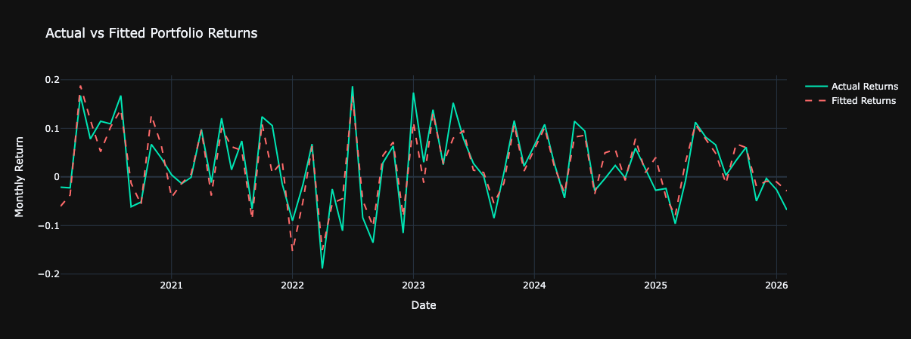
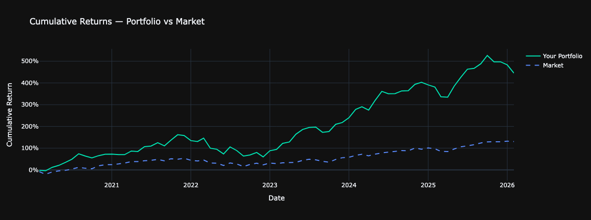
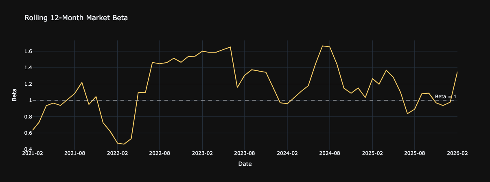

# 📊 Factor Exposure Analyzer

A Python-based tool that analyzes any stock portfolio's exposure to the five classic Fama-French risk factors — market, size, value,  profitability, and investment.

Inspired by institutional factor models like Barra, this tool helps answer the most important question in portfolio analysis: are your  returns driven by skill, or just factor exposure?

## Features

- User inputs any tickers, start date, and portfolio weights at runtime — no code changes required
- Pulls live stock price data via Yahoo Finance
- Pulls real Fama-French 5 factor data directly from Kenneth French's research library at Dartmouth — the same dataset used by academic researchers and institutional quant teams
- Runs a proper OLS regression of portfolio excess returns against all five factors using statsmodels
- Outputs a clean factor exposure report with coefficients, p-values, and plain English significance labels
- Calculates and annualizes alpha using standard compounding formula
- Generates 4 interactive Plotly visualizations

## Screenshots

### Factor Contribution

Horizontal bar chart showing each factor coefficient — green for positive tilt, red for negative. Instantly visualizes your portfolio's  factor profile.

### Actual vs Fitted Returns

Line chart overlaying real portfolio returns against model-predicted returns. Visually represents how well the five factors explain your  portfolio's monthly movements.

### Cumulative Returns — Portfolio vs Market

Compares your portfolio's compounded growth against the total US market  over the selected time period.

### Rolling 12-Month Beta

Shows how your market sensitivity has evolved over time using a rolling regression window — revealing beta drift that static models miss.

## How to Run
1. Clone this repository or download the files
2. Install the required libraries
3. Open `Factor Exposure Analyzer.ipynb` in Jupyter Notebook
4. Run all cells from top to bottom
5. Enter your inputs when prompted:
   - Start date (e.g. 2022-01-01)
   - Tickers (e.g. AAPL, MSFT)
   - Portfolio weights as whole numbers summing to 100 (e.g. 50 50)
  
## Tech Stack
- **Python 3**
- **yfinance** — live stock price data via Yahoo Finance
- **pandas-datareader** — Fama-French factor data from Dartmouth
- **pandas** — data manipulation and alignment
- **numpy** — financial calculations
- **statsmodels** — OLS regression engine
- **plotly** — interactive chart visualizations

## What the Output Tells You

| Factor | What it measures |
|---|---|
| Alpha | Unexplained return after controlling for all factors |
| Market Beta | Sensitivity to overall market movements |
| SMB | Tilt toward small caps (positive) or large caps (negative) |
| HML | Tilt toward value (positive) or growth (negative) |
| RMW | Tilt toward profitable (positive) or unprofitable companies |
| CMA | Tilt toward conservative (positive) or aggressive investors |

A statistically significant alpha (p < 0.05) suggests genuine  outperformance beyond factor exposure. Most portfolios — including many actively managed funds — show no significant alpha once factor tilts are properly accounted for.
