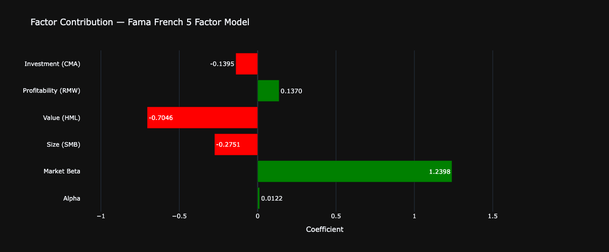

# 📊 Factor Exposure Analyzer

A Python-based tool that analyzes any stock portfolio's exposure to the five classic Fama-French risk factors — market, size, value,  profitability, and investment.

Inspired by institutional factor models like Barra, this tool helps answer the most important question in portfolio analysis: are your  returns driven by skill, or just factor exposure?

## Features

- User inputs any tickers, start date, and portfolio weights at runtime — no code changes required
- Pulls live stock price data via Yahoo Finance
- Pulls real Fama-French 5 factor data directly from Kenneth French's research library at Dartmouth — the same dataset used by academic researchers and institutional quant teams
- Runs a proper OLS regression of portfolio excess returns against all five factors using statsmodels
- Outputs a clean factor exposure report with coefficients, p-values, and plain English significance labels
- Calculates and annualizes alpha using standard compounding formula
- Generates 4 interactive Plotly visualizations

## Screenshots

### Factor Contribution

